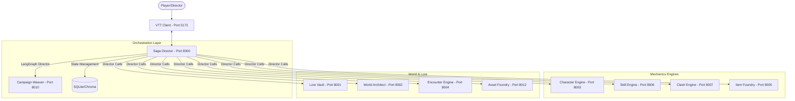

# TALEWEAVERS System Architecture

This document outlines the high-level architecture of the TALEWEAVERS engine and how the various microservices interact.

## Data Flow & Orchestration

The system follows a decentralized microservice architecture where the **Saga Director** acts as the central orchestrator (Director).

## Module Definitions

### 1. The Director (Saga Director)
Built with **FastAPI** and **LangGraph**, the Director uses a state machine to move the game through four phases:
1. **Fetch Context**: Consults the Lore Vault and World Architect.
2. **Resolve Mechanics**: Calls Skill/Clash engines for dice logic.
3. **Chaos Check**: The "Fate Engine" evaluates unpredictable shifts in the world.
4. **Director**: AI logic to determine the logical next step.
5. **Narrator**: Streams the result back to the user via LLM.

### 2. Mechanics Engines (Stateless)
Modules 3, 5, 6, and 7 are purely mathematical. They do not store state. They take a JSON input of stats/items and return a JSON output of calculated results. This ensures the rules are centralized and easily testable.

### 3. World & History (Stateful)
- **World Architect**: A C++ engine that generates the physical world (Voronoi map, climate, geology).
- **Lore Vault**: A vector database (ChromaDB) storing the "knowledge" of the world.
- **Asset Foundry**: A performance-optimized asset server providing the VTT with a **Texture Atlas** comprising over 700 high-fidelity PNGs.

## Tech Stack
- **Backend**: Python 3.10+, FastAPI, Pydantic, LangChain/LangGraph.
- **Frontend**: React, TypeScript, Vite, PixiJS, Tailwind CSS.
- **Database**: SQLite (Campaign State), ChromaDB (Lore/Context).
- **World Gen**: C++17, SDL2/OpenGL, jc_voronoi.
