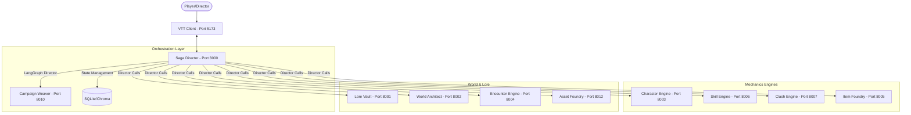

# 🧶 TALEWEAVERS

**The Ultimate Storytelling & Saga Director Orchestration Engine**

TALEWEAVERS is a suite of AI-driven microservices designed to facilitate deep, immersive tabletop roleplaying experiences. From procedural world architecture to dynamic encounter resolution and AI-narrated campaigns, TALEWEAVERS handles the "math and lore" so Directors and players can focus on the story.

---

## 🚀 The S.A.G.A. Ecosystem

The system follows a decentralized microservice architecture where the **Saga Director** acts as the central orchestrator (Director).

| Module | Name | Port | Description |
| :--- | :--- | :--- | :--- |
| **00** | **VTT Client** | 5173 | The visual interface for players and Directors (React/PixiJS). |
| **01** | **Lore Vault** | 8001 | Central repository for world facts, cultures, and history (ChromaDB). |
| **02** | **World Architect** | 8002 | Procedural map and physics/calendar simulator (C++ Engine). |
| **03** | **Character Engine** | 8003 | Survival pools, evolution, and loadout calculations (Stateless). |
| **04** | **Encounter Engine** | 8004 | AI-driven threat generation and combat orchestration. |
| **05** | **Item Foundry** | 8005 | Economy, D-Dust math, and equipment effects (Stateless). |
| **06** | **Skill Engine** | 8006 | Tactical triad calculations (Aggressive, Skirmish, etc.) (Stateless). |
| **07** | **Clash Engine** | 8007 | Margin-of-Victory resolution for combat actions (Stateless). |
| **08** | **Chronos** | 9000 | Time-tracking and event scheduling. |
| **09** | **Saga Director** | 8000 | The "Director" node using LangGraph to weave it all together. |
| **10** | **Campaign Weaver** | 8010 | Procedural quest and campaign roadmap generator. |
| **11** | **Chaos Engine** | N/A | Integrated "Fate Engine" for unpredictable world shifts. |
| **12** | **Asset Foundry** | 8012 | High-performance texture server and atlas optimizer. |

## 🏗️ Architecture & Orchestration

The system is categorized into three primary layers, ensuring separation of concerns and scalable performance:

1. **Orchestration Layer**: Driven by the **Saga Director** (FastAPI + LangGraph). It manages the game loop through five phases:
   - *Fetch Context*: Consults the Lore Vault and World Architect.
   - *Resolve Mechanics*: Calls Skill/Clash engines for dice logic.
   - *Chaos Check*: The "Fate Engine" evaluates unpredictable shifts in the world.
   - *Director*: AI logic to determine the logical next step.
   - *Narrator*: Streams the result back to the user via LLM.
2. **Mechanics Engines (Stateless)**: Purely stateless modules (Character, Skill, Clash, Item Foundry) that accept JSON inputs and return calculated outcomes. This ensures the rules are centralized and easily testable.
3. **World & Lore (Stateful)**: Includes the World Architect (C++ engine generating physical worlds via Voronoi maps), Lore Vault (ChromaDB vector store), and Asset Foundry (provides the VTT with a Texture Atlas of 700+ high-fidelity PNGs).

### Data Flow



### Tech Stack
- **Backend**: Python 3.10+, FastAPI, Pydantic, LangChain/LangGraph.
- **Frontend**: React, TypeScript, Vite, PixiJS, Tailwind CSS.
- **Database**: SQLite (Campaign State), ChromaDB (Lore/Context).
- **World Gen**: C++17, SDL2/OpenGL, jc_voronoi.

## 🛠️ Getting Started

### Prerequisites
- **Python 3.10+**
- **Node.js 18+** (for VTT Client)
- **Local LLM** (Ollama recommended for Campaign Weaver/Director)

### Installation & Launch
The easiest way to start the entire ecosystem on Windows is using the provided batch script:

```bash
run_all.bat
```

This will launch all microservices in separate terminal windows and open the VTT client at `http://localhost:5173`.

## 📜 Mechanics Overview
TALEWEAVERS uses a custom "Lead & Trail" stat system. 
- **Lead Stat**: Determines the primary action modifier and costs resources (Stamina/Focus).
- **Trail Stat**: Determines the reactive defense modifier.
- **Assault/Resolve**: Combat is resolved via "Clashes" where margin-of-victory determines the severity of the outcome.

For a detailed breakdown of the 36 Tactical Skills, see [crucial.md](./crucial.md).

## 🛡️ License
Proprietary. All rights reserved.
